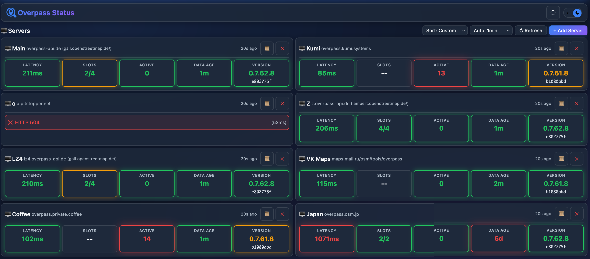

# Overpass API Status Monitor

A simple, client-side web application for monitoring the health and performance of Overpass API servers in real-time.

## Features

- Real-time server status monitoring
- Response time tracking and averages
- Query slot availability
- Data freshness indicators
- Support for public and self-hosted Overpass servers
- Dark/light theme support
- Export/import server configurations
- Drag-and-drop server ordering

## Demo

See it in action: [skeffling.net/overpass-status](https://skeffling.net/overpass-status)

## Usage

Simply open `index.html` in a web browser. No build step or server required.

## License

MIT
